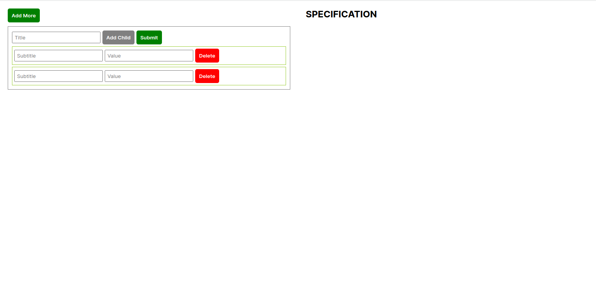
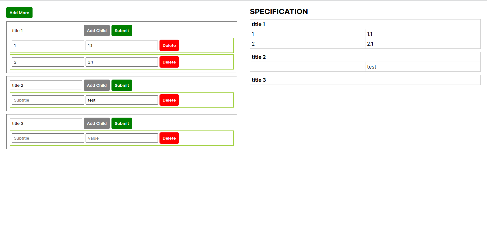

# Angular Task: Add More

### Task:
- Add more buttons will add a similar box below the main box.
- Add child will add a child in the respective parent.
- The delete button will delete the child.
- Submit button will append details of that box under “SPECIFICATION” section
- The order of the left side table and right side details will remain the same
- If someone submits the 3rd table first and then submits the 2nd table then at the specification side, the first 2nd table will display and then the 3rd table. Order of submission is not important. The order of the table is important.
- If you add/delete a child after submitting that table then it will affect the right side when you submit that table a second time.

### Preview:

