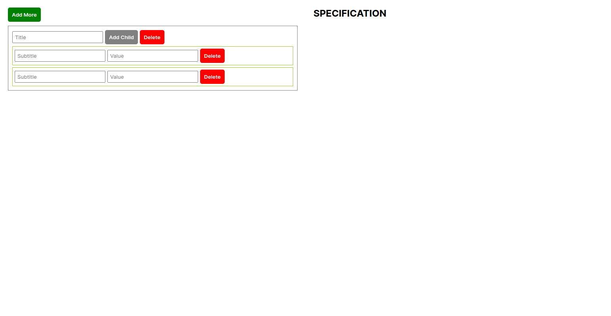

# Angular Task: Add More Without Submit Button

### Task:
- Remove the submit button from the [previous task](https://github.com/darshanpatel-weboccult/angular-add-more/tree/version-4.1).
- When the user will write anything in the table at the same time that value will be added in the SPECIFICATION part.
- Add a delete button to delete parents.
- Add [Sweetalert2](https://sweetalert2.github.io/v10.html) alert box to take confirmation before deleting anything.

### Preview:

